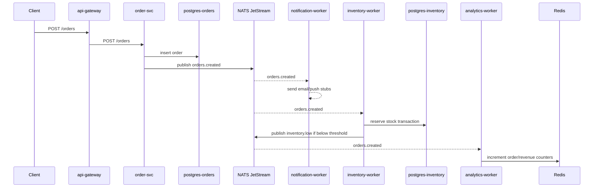
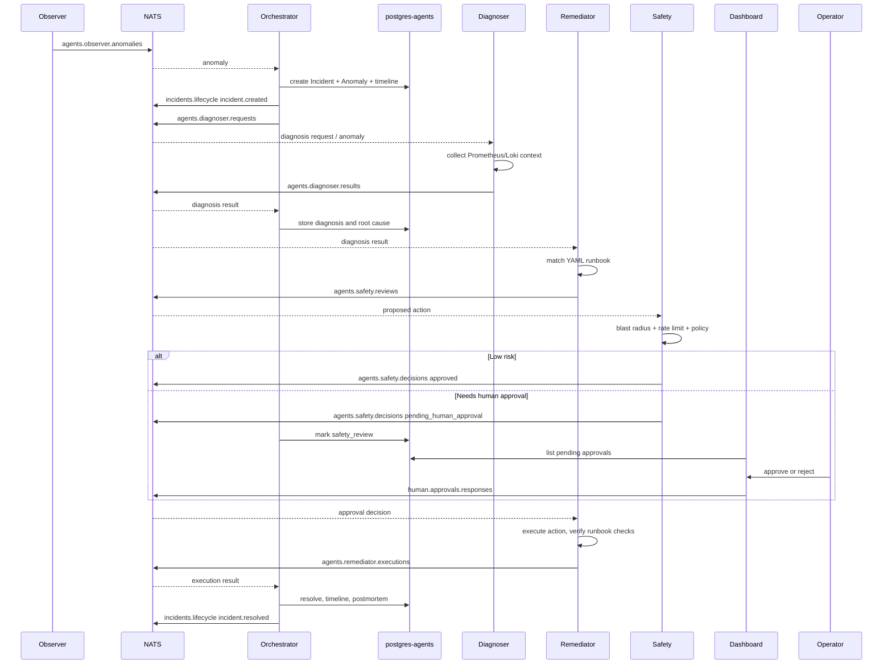
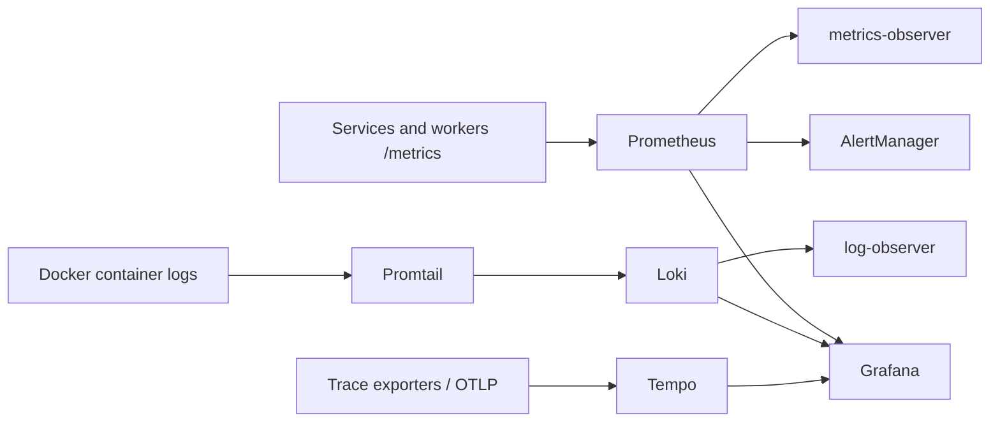

# Current Project Architecture

This document describes the architecture that exists in the repository today. It is meant to be a practical map for developers and operators: what runs, what talks to what, where data lives, and how incidents flow through the agent swarm.

## 1. System Purpose

The project is a self-healing DevOps Agent Swarm around a local e-commerce-style microservices environment. The application services intentionally provide a realistic failure surface: HTTP APIs, background workers, several databases, Redis, Elasticsearch, NATS JetStream, and an observability stack.

The agent control plane watches that environment, detects abnormal behavior, diagnoses likely root causes, proposes remediations, gates risky actions through policy and human approval, executes approved actions, verifies recovery, and records incident history for future learning.

## 2. Architecture At A Glance

The runtime is organized into four planes:

- Target application plane: the demo services and workers that represent production infrastructure.
- Agent control plane: observer, diagnoser, remediator, safety, orchestrator, and learner agents.
- Data and messaging plane: PostgreSQL, Redis, Elasticsearch, NATS JetStream, and ChromaDB/local vector storage.
- Human and observability plane: dashboard API/frontend, Prometheus, Grafana, Loki, Tempo, AlertManager, and chaos tooling.

```mermaid
flowchart TB
  user[External client / operator]

  subgraph app["Target application plane"]
    gateway["api-gateway :8000"]
    userSvc["user-svc :8001"]
    authSvc["auth-svc :8004"]
    orderSvc["order-svc :8002"]
    paymentSvc["payment-svc :8005"]
    productSvc["product-svc :8003"]
    searchSvc["search-svc :8006"]
    notification["notification-worker :8007"]
    inventory["inventory-worker :8008"]
    analytics["analytics-worker :8009"]
  end

  subgraph data["Data and messaging plane"]
    redis[(Redis)]
    pgOrders[(postgres-orders)]
    pgPayments[(postgres-payments)]
    pgInventory[(postgres-inventory)]
    pgAgents[(postgres-agents)]
    es[(Elasticsearch)]
    nats[(NATS JetStream)]
    chroma[(ChromaDB / local vector store)]
  end

  subgraph observability["Observability plane"]
    prometheus["Prometheus :9090"]
    grafana["Grafana :3000"]
    loki["Loki :3100"]
    tempo["Tempo :3200"]
    alertmanager["AlertManager :9093"]
  end

  subgraph control["Agent control plane"]
    observers["Observer pool"]
    diagnoser["Diagnoser"]
    remediator["Remediator"]
    safety["Safety"]
    orchestrator["Orchestrator"]
    learner["Learner"]
  end

  subgraph dashboard["Human interface"]
    dashboardApi["dashboard-api :8010"]
    dashboardUi["dashboard-frontend :3001"]
  end

  user --> gateway
  user --> dashboardUi
  dashboardUi --> dashboardApi

  gateway --> userSvc
  gateway --> authSvc
  gateway --> orderSvc
  gateway --> paymentSvc
  gateway --> productSvc
  gateway --> searchSvc

  userSvc --> redis
  authSvc --> redis
  orderSvc --> pgOrders
  paymentSvc --> pgPayments
  productSvc --> es
  searchSvc --> es

  orderSvc --> nats
  paymentSvc --> nats
  nats --> notification
  nats --> inventory
  nats --> analytics
  inventory --> pgInventory
  analytics --> redis

  prometheus --> userSvc
  prometheus --> authSvc
  prometheus --> orderSvc
  prometheus --> paymentSvc
  prometheus --> productSvc
  prometheus --> searchSvc
  prometheus --> notification
  prometheus --> inventory
  prometheus --> analytics
  grafana --> prometheus
  grafana --> loki
  grafana --> tempo
  alertmanager --> prometheus

  observers --> prometheus
  observers --> loki
  observers --> gateway
  observers --> nats
  nats --> orchestrator
  nats --> diagnoser
  nats --> remediator
  nats --> safety
  nats --> learner
  orchestrator --> pgAgents
  dashboardApi --> pgAgents
  dashboardApi --> nats
  learner --> chroma
```

## 3. Repository Layout

| Path | Responsibility |
| --- | --- |
| `services/` | Target application services, gateway, and business workers. |
| `agents/` | Agent implementations: observer, diagnoser, remediator, safety, orchestrator, learner. |
| `shared/` | Shared Python package for agent base class, messaging, config, logging, DB models, and DB session handling. |
| `dashboard/` | FastAPI dashboard backend and React/Vite frontend. |
| `config/` | Prometheus, AlertManager, Loki, Tempo, and Grafana provisioning. |
| `scripts/` | NATS initialization and chaos engineering tooling. |
| `docs/` | Architecture, workflows, agent references, operations, and development notes. |
| `docker-compose.infrastructure.yml` | Core infrastructure: PostgreSQL, Redis, NATS JetStream, Elasticsearch. |
| `docker-compose.yml` | Full local stack: application services, workers, observability, agents, and dashboard. |
| `Makefile` | Common operations for startup, tests, health checks, and cleanup. |

## 4. Runtime Components

### 4.1 Application Services

| Component | Runtime | Port | Main dependencies | Purpose |
| --- | --- | ---: | --- | --- |
| `api-gateway` | Nginx | 8000 | Docker DNS | External entrypoint and route fanout to service APIs and dashboard paths. |
| `user-svc` | FastAPI | 8001 | Redis DB 0 | User CRUD and profile storage. |
| `auth-svc` | Node.js/Express | 8004 | Redis DB 1 | Registration, JWT login, token verification, refresh, logout blacklist. |
| `order-svc` | Go/Gin | 8002 | `postgres-orders`, NATS | Order lifecycle, order persistence, publishes `orders.created`. |
| `payment-svc` | FastAPI | 8005 | `postgres-payments`, NATS | Payment creation, refund handling, publishes payment events. |
| `product-svc` | Django/DRF | 8003 | SQLite metadata, Elasticsearch | Product/category CRUD and product indexing into Elasticsearch. |
| `search-svc` | FastAPI | 8006 | Elasticsearch | Full-text search and autocomplete over the product index. |
| `notification-worker` | Python/FastAPI sidecar | 8007 | NATS | Consumes business events and emits stub email, push, and Slack notifications. |
| `inventory-worker` | Go | 8008 | NATS, `postgres-inventory` | Reserves stock from `orders.created` and emits `inventory.low`. |
| `analytics-worker` | Python/FastAPI sidecar | 8009 | NATS, Redis DB 2 | Aggregates order/payment counters and publishes `analytics.summary`. |

### 4.2 Agent Services

| Agent | Key source | Inputs | Outputs | Responsibility |
| --- | --- | --- | --- | --- |
| Observer pool | `agents/observer/src/` | Prometheus, Loki, HTTP health endpoints, synthetic probes | `agents.observer.anomalies` | Detect metrics, log, health, and synthetic transaction anomalies. |
| Diagnoser | `agents/diagnoser/src/` | Anomalies, Prometheus, Loki, incident store | `agents.diagnoser.results` | Correlate anomalies, gather context, generate RCA hypotheses and confidence. |
| Remediator | `agents/remediator/src/` | Diagnosis results, safety decisions, YAML runbooks, Docker socket | `agents.safety.reviews`, `agents.remediator.executions` | Match RCA to a runbook, propose action, execute approved action, verify recovery, roll back on verification failure. |
| Safety | `agents/safety/src/` | Remediation proposals | `agents.safety.decisions` | Calculate blast radius, enforce policy, rate limit repeated actions, request human approval for risky work. |
| Orchestrator | `agents/orchestrator/src/` | Anomalies, diagnosis results, safety decisions, execution results, approvals, heartbeats | Diagnosis requests, lifecycle events, DB writes | Own incident FSM, timelines, retries, timeout escalation, and postmortem generation. |
| Learner | `agents/learner/src/` | `agents.learning.feedback`, query requests | Learning query responses, vector DB writes | Store resolved incidents as embeddings and track runbook performance. |

Note: source for the learner exists, but `docker-compose.yml` currently does not define a `learner-agent` service. The learner uses a local ChromaDB path by default rather than a separate compose-managed Chroma service.

### 4.3 Infrastructure

| Component | Port | Used by | Data |
| --- | ---: | --- | --- |
| `postgres-agents` | 5432 | Orchestrator, dashboard, learner optimizer | Incidents, anomalies, agent heartbeat state, incident timelines, postmortems. |
| `postgres-orders` | 5433 host / 5432 container | Order service | Orders and status transitions. |
| `postgres-payments` | 5434 host / 5432 container | Payment service | Payments and refunds. |
| `postgres-inventory` | 5435 host / 5432 container | Inventory worker | Stock and reservations. |
| Redis | 6379 | User, auth, analytics | Users/session-like data, JWT refresh and blacklist entries, analytics counters. |
| NATS JetStream | 4222, 8222 | Services, workers, agents, dashboard | Business events, agent messages, lifecycle events, human approval messages. |
| Elasticsearch | 9200 | Product and search services | Product search index. |

## 5. Messaging Architecture

Inter-agent messages use the shared `AgentMessage` envelope from `shared/messaging/schema.py`.

Important fields:

- `message_id`: unique message identifier.
- `correlation_id`: stable incident/request identifier across the workflow.
- `trace_id`: trace propagation identifier.
- `source_agent` and `target_agent`: logical routing metadata.
- `message_type`: semantic event type.
- `priority`: `0` critical through `3` low.
- `ttl_seconds`: expiry budget so stale messages can be discarded.
- `payload`: event-specific data.
- `context`: accumulated evidence and workflow context.

JetStream streams are initialized by `scripts/init_nats.py`:

| Stream | Subjects | Retention intent |
| --- | --- | --- |
| `AGENTS` | `agents.*` subjects and `agents.heartbeat` | Agent traffic and heartbeats for 24 hours. |
| `INCIDENTS` | `incidents.lifecycle` | Lifecycle events for 7 days. |
| `HUMAN` | `human.approvals`, `human.approvals.responses` | Short-lived approval requests and responses. |
| `BUSINESS` | `orders.created`, `payments.completed`, `payments.failed`, `inventory.low` | Business events for 3 days. |

Primary subjects:

| Subject | Publisher | Consumer |
| --- | --- | --- |
| `agents.observer.anomalies` | Observer pool | Orchestrator, diagnoser |
| `agents.diagnoser.requests` | Orchestrator | Diagnoser, by design |
| `agents.diagnoser.results` | Diagnoser | Orchestrator, remediator |
| `agents.safety.reviews` | Remediator | Safety |
| `agents.safety.decisions` | Safety | Orchestrator, remediator |
| `agents.remediator.executions` | Remediator | Orchestrator |
| `agents.learning.feedback` | Remediator/post-incident workflow | Learner |
| `agents.heartbeat` | All agents | Orchestrator, dashboard bridge |
| `incidents.lifecycle` | Orchestrator | Dashboard WebSocket bridge |
| `human.approvals.responses` | Dashboard API | Orchestrator |
| `orders.created` | Order service | Notification, inventory, analytics |
| `payments.completed` | Payment service | Notification, analytics |
| `payments.failed` | Payment/refund service | Notification, analytics |
| `inventory.low` | Inventory worker | Notification |

## 6. Business Dataflows

### 6.1 User And Auth Flow

1. Client calls `api-gateway` at `/auth/register` or `/auth/login`.
2. Gateway proxies to `auth-svc`.
3. `auth-svc` stores registered users and password hashes in Redis and stores refresh tokens under `refresh:{user_id}`.
4. Login verifies bcrypt password, issues access and refresh JWTs, and returns user identity.
5. Logout blacklists the access token in Redis until token expiry.
6. `user-svc` also exposes CRUD endpoints through `/users/*`, backed by Redis keys `user:{id}` and `user:email:{email}`.

### 6.2 Product And Search Flow

1. Client calls `/products/*` through the gateway.
2. `product-svc` handles category and product CRUD with Django REST Framework.
3. Product metadata is stored in local SQLite by default.
4. On create/update/delete/reindex, product documents are written to or removed from the Elasticsearch `products` index.
5. Client calls `/search` or `/search/autocomplete`.
6. `search-svc` queries Elasticsearch with full-text, filters, sort modes, facets, and autocomplete.

### 6.3 Order Event Fanout Flow

Current code publishes `orders.created` best-effort. If NATS is unavailable, the order service continues operating and logs a warning.

### 6.4 Payment Flow

1. Client calls `/payments` through the gateway.
2. `payment-svc` inserts a payment row into `postgres-payments`.
3. The current implementation simulates successful payment processing.
4. `payment-svc` publishes `payments.completed`.
5. `notification-worker` sends a receipt stub.
6. `analytics-worker` increments payment success counters.
7. Refunds update payment status to `refunded` and publish `payments.failed` with reason `refunded`.

## 7. Incident Control Flow

The orchestrator owns the incident finite state machine:

`detecting -> diagnosing -> proposing_remediation -> safety_review -> executing -> verifying -> resolved -> closed`

Retry loops:

- `safety_review -> proposing_remediation` when an action is rejected and retries remain.
- `executing -> proposing_remediation` when execution fails and retries remain.
- `verifying -> executing` when verification fails and retries remain.

Timeouts:

| State | Timeout |
| --- | ---: |
| `detecting` | 120 seconds |
| `diagnosing` | 180 seconds |
| `proposing_remediation` | 120 seconds |
| `safety_review` | 300 seconds |
| `executing` | 180 seconds |
| `verifying` | 120 seconds |

Max retries per state: `2`.

### 7.1 Detection

The observer pool has four modes:

- Metrics observer: polls Prometheus every 15 seconds for CPU, error rate, and p99 latency; uses static and dynamic thresholding plus trend prediction.
- Log observer: queries Loki for error/warning patterns.
- Health observer: probes service `/health` endpoints every 10 seconds.
- Synthetic prober: exercises user-facing flows through the gateway.

Detected anomalies are deduplicated before publishing.

### 7.2 Diagnosis

The diagnoser builds context around the anomaly:

- Prometheus metrics for the affected service.
- Loki logs in a time window around the anomaly.
- Correlated incident context.
- Hypothesis generation and optional debate when confidence is low.

The output is an RCA payload with root cause category, root cause service, reasoning, and confidence.

### 7.3 Remediation

Runbooks live in `agents/remediator/runbooks/` and currently cover:

- `memory_leak`: restart affected container, low risk, auto-approval allowed.
- `database_overload`: restart `pgbouncer`, medium risk, human approval required.
- `network_partition`: open a circuit breaker, high risk, human approval required.

The action executor supports real Docker container restarts through the Docker socket and mocked circuit-breaker behavior. The verification engine runs runbook checks, primarily HTTP health checks.

### 7.4 Safety And Human Approval

Safety evaluation applies:

- Blast-radius calculation.
- Action rate limiting.
- Policy rules for approval requirements, high-risk actions, banned core-infra targets, and scaling limits.

Approved actions flow back to the remediator. Risky actions produce `pending_human_approval`; the dashboard API lets an operator approve or reject by publishing `human.approvals.responses`.

### 7.5 Persistence And Audit Trail

The orchestrator stores:

- `Incident`: status, severity, diagnosis, confidence, root cause, runbook, remediation actions, escalation reason, timeline, postmortem, resolution timestamps.
- `Anomaly`: raw observer signal, metric/service/severity, thresholds, values, labels, fingerprint.
- `AgentHeartbeat`: agent identity, type, status, last seen timestamp, and metrics.

Incident timelines are appended during detection, diagnosis, approval, execution, verification, resolution, and escalation.

## 8. Dashboard Flow

The dashboard has two parts:

- `dashboard-api`: FastAPI REST and WebSocket service on port `8010`.
- `dashboard-frontend`: React/Vite UI served on port `3001`.

REST endpoints:

| Endpoint | Purpose |
| --- | --- |
| `GET /api/incidents` | List incidents with status/severity filters. |
| `GET /api/incidents/stats` | Aggregate counts and MTTR. |
| `GET /api/incidents/{id}` | Full incident details. |
| `GET /api/incidents/{id}/timeline` | Timeline only. |
| `GET /api/agents` | Agent heartbeat/status list. |
| `GET /api/approvals` | Pending approval list from incidents in `safety_review`. |
| `POST /api/approvals/{id}/approve` | Publish human approval response to NATS. |
| `POST /api/approvals/{id}/reject` | Publish human rejection response to NATS. |

The API starts a NATS-to-WebSocket bridge for:

- `incidents.lifecycle` -> incident create/update/resolve UI events.
- `agents.heartbeat` -> agent health UI events.
- `human.approvals` -> approval request UI events.

The gateway also exposes dashboard paths under `/api/dashboard/`, `/dashboard/ws`, and `/dashboard/`.

## 9. Observability Flow

Prometheus scrapes the services and workers every 15 seconds. Grafana is provisioned with data sources and dashboards. Loki receives container logs through Promtail. Tempo is configured as the trace backend. AlertManager is wired into Prometheus rules.

Implementation note: `config/prometheus/prometheus.yml` includes a `node-exporter:9100` scrape target, but the current compose files do not define a `node-exporter` service.

## 10. Chaos Workflow

Chaos tooling lives under `scripts/chaos/`.

Primary pieces:

- `injector.py`: primitives for failure injection.
- `runner.py`: scenario execution and timing.
- `scoring.py`: grades MTTD/MTTR and scenario outcomes.
- `scenarios/`: CPU spike, memory leak, DB overload, and network partition definitions.

Expected chaos loop:

1. Start infrastructure, services, observability, agents, and dashboard.
2. Initialize NATS streams.
3. Run a chaos scenario.
4. Observer detects the failure and publishes an anomaly.
5. Orchestrator drives diagnosis, remediation, safety review, and verification.
6. Runner measures detection and recovery timing.
7. Scoring produces a scenario result/report.

## 11. Startup And Operations

Common commands:

| Command | Purpose |
| --- | --- |
| `make infra-up` | Start PostgreSQL, Redis, NATS, and Elasticsearch. |
| `make init-nats` | Create or update JetStream streams. |
| `make up` | Build and start the full compose stack from `docker-compose.yml`. |
| `make obs-up` | Start only observability services from the full compose file. |
| `make agents-up` | Start observer, diagnoser, safety, remediator, and orchestrator containers. |
| `make dashboard-up` | Start only dashboard API and frontend. |
| `make health` | Curl all health endpoints. |
| `make test` | Run Python and Go unit tests. |
| `make clean` | Stop services and remove volumes/caches. |

Recommended full local boot:

1. `make infra-up`
2. `make init-nats`
3. `make up`
4. `make health`

For narrower workflows, use `make infra-up`, `make obs-up`, `make agents-up`, and `make dashboard-up` to bring up only parts of the system.

## 12. Current Implementation Notes

- The codebase has both design docs and implementation. This document follows the implementation as much as possible.
- The low-level design mentions gRPC for some service interactions, but the current service implementations use HTTP for gateway-facing APIs and NATS for event fanout.
- The learner agent source and tests exist, but it is not currently wired into `docker-compose.yml`.
- The project includes ChromaDB usage in the learner code, but no separate ChromaDB compose service is defined.
- The remediator mounts the Docker socket in compose so container restart actions can be real in local Docker.
- Several service event publishers are intentionally best-effort; application requests can still succeed if NATS is temporarily unavailable.
- Existing docs and Makefile status text may be slightly ahead of compose wiring in a few places, especially around learner startup.
